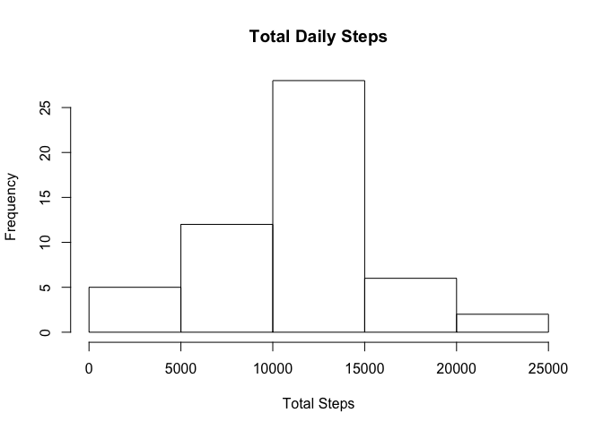
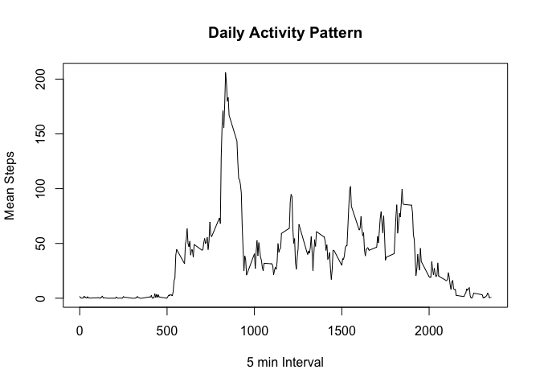
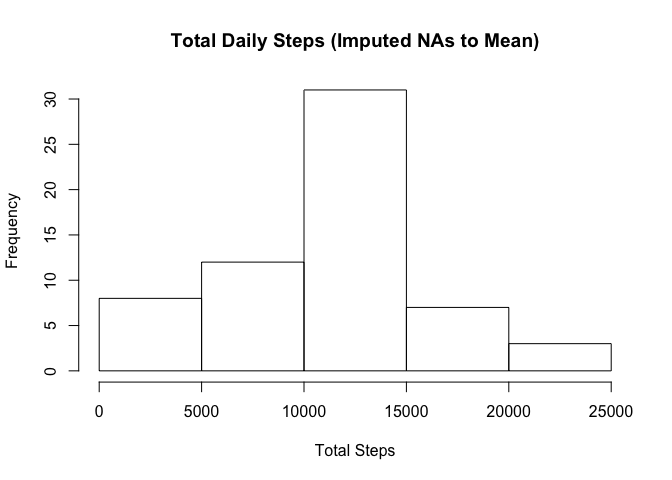
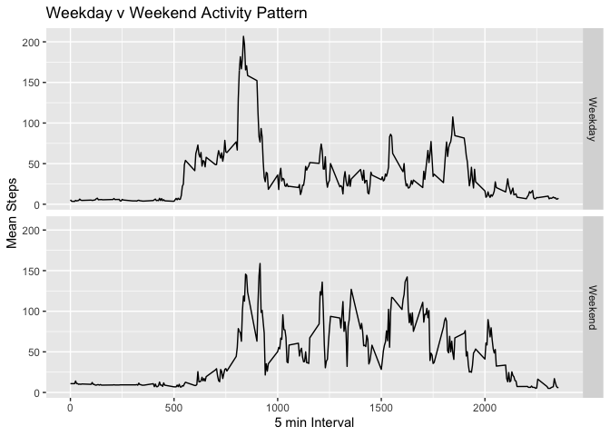

## Loading and preprocessing the data

```r
# Load the Activity data
activity <- read.csv("activity.csv", header = TRUE, stringsAsFactors = TRUE, colClasses = c("numeric","character","numeric")) 
# Convert to a Date
activity$date <- as.Date(activity$date, format = "%Y-%m-%d", tz = "UTC")
```

## What is mean total number of steps taken per day?

```r
# Aggregate the Total steps by Day
activity.total.byDay <- aggregate(steps ~ date, FUN = sum, data = activity)
# Histogram of total daily steps
hist(activity.total.byDay$steps, main = "Total Daily Steps", xlab = "Total Steps")
```

<!-- -->

```r
# Mean & Median total number of steps taken per day
summary(activity.total.byDay$steps)
```

```
##    Min. 1st Qu.  Median    Mean 3rd Qu.    Max. 
##      41    8841   10765   10766   13294   21194
```

## What is the average daily activity pattern?

```r
# Aggregate the Interval Mean Steps
activity.daily.pattern <- aggregate(steps ~ interval, FUN = mean, data = activity)
# Plot the Intervals with Mean Steps
plot(activity.daily.pattern
     , main = "Daily Activity Pattern"
     , xlab = "5 min Interval"
     , ylab = "Mean Steps"
     , type = "l"
     )
```

<!-- -->

```r
# The time interval with the Max Mean Daily Steps
activity.daily.pattern[activity.daily.pattern$steps == max(activity.daily.pattern$steps), ]
```

```
##     interval    steps
## 104      835 206.1698
```
## Imputing missing values

```r
# Number of NA cases in the data
sum(is.na(activity$steps))
```

```
## [1] 2304
```

```r
# Fill in the NA values with the Mean for that time interval from the overall dataset
activity.na.to.mean <- merge(x = activity[is.na(activity$steps),] 
      ,y = activity.daily.pattern 
      ,by = "interval"
      )
# Copy the original dataset to hold the dataset with imputed values
activity.imputed <- activity
# Change the NA values to the imputed values
activity.imputed[is.na(activity.imputed$steps), "steps"] <- activity.na.to.mean$steps.y
```
Show the histogram for the imputed dataset

```r
# Aggregate the Total steps by Day
activity.imputed.total.byDay <- aggregate(steps ~ date, FUN = sum, data = activity.imputed)
# Histogram of total daily steps
hist(activity.imputed.total.byDay$steps, main = "Total Daily Steps (Imputed NAs to Mean)", xlab = "Total Steps")
```

<!-- -->
Compare the summaries of the Original and Imputed datasets

```r
# Imputed - Mean & Median total number of steps taken per day
summary(activity.imputed.total.byDay$steps)
```

```
##    Min. 1st Qu.  Median    Mean 3rd Qu.    Max. 
##      41    8821   11015   10766   13646   24444
```

```r
# Original - Mean & Median total number of steps taken per day
summary(activity.total.byDay$steps)
```

```
##    Min. 1st Qu.  Median    Mean 3rd Qu.    Max. 
##      41    8841   10765   10766   13294   21194
```

```r
# Difference between the Original and Imputed Means
mean((activity.imputed.total.byDay$steps)) - mean((activity.total.byDay$steps))
```

```
## [1] 0
```
There is no difference in the Means between the Original and Imputed dataset

```r
# Difference between the Original and Imputed Totals of the days
sum((activity.imputed.total.byDay$steps)) - sum((activity.total.byDay$steps))
```

```
## [1] 86129.51
```
There is a differece in Total steps between the Original and Imputed dataset

## Are there differences in activity patterns between weekdays and weekends?

```r
# Flag Weekday v Weekend
activity.imputed$DOW <- ifelse( 
    weekdays(activity.imputed$date, abbreviate = TRUE) %in% c("Sat", "Sun"), "Weekend"
    , "Weekday")
# Aggregate the Mean steps
activity.imputed.DOW <- aggregate(steps ~ DOW + interval, FUN = mean, data = activity.imputed)
# Plot the Intervals with Mean Steps
library(ggplot2)
qplot(interval, steps
      , data = activity.imputed.DOW
      , facets = DOW ~ .
      , main = "Weekday v Weekend Activity Pattern"
      , xlab = "5 min Interval"
      , ylab = "Mean Steps"
      , geom = "line"
      )
```

<!-- -->

